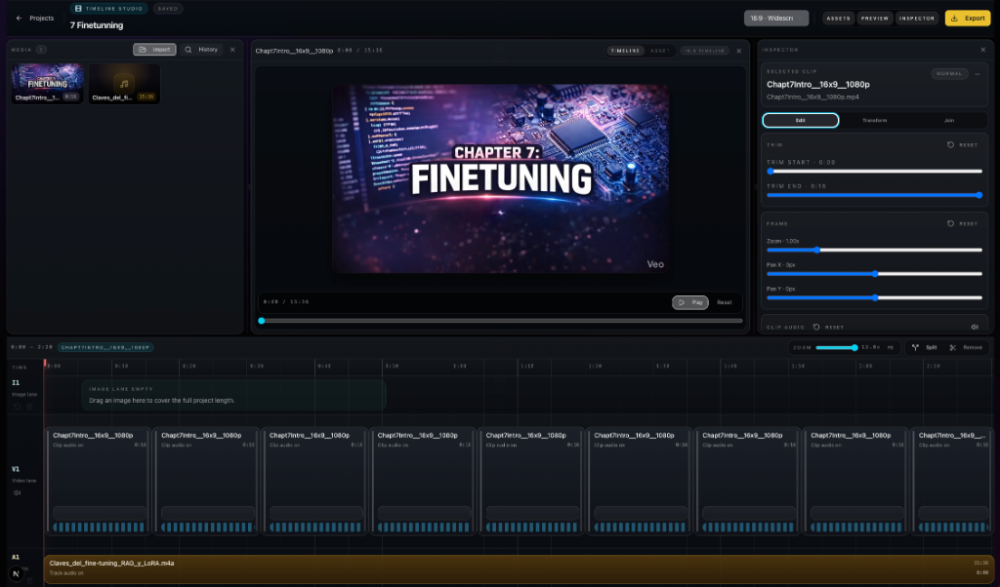

# ClipScribe

<div align="center">
  
</div>

<div align="center">
  
  
  
</div>

A modern, privacy-first web application built with [Next.js](http://nextjs.org) that lets you drag and drop audio and video files for local transcription, subtitle workflows, and short-form clip creation. ClipScribe keeps the entire process in the browser so your media stays on your device.

The application leverages a local Web Worker and client-side processing via Transformers.js for transcriptions, and FFmpeg WASM for video manipulation, ensuring efficient, private, and fast execution directly on your device.


## Key Features

- 🔒 **100% Private (Local Processing)**: Audio transcription is handled directly in your browser. No data is ever sent to a remote server or API. Fast, secure, and zero server-side costs.
- 🌍 **Language Auto-Detection & Selector**: By default, the app automatically detects the spoken language. You can also explicitly set the language (Spanish, English, French, and 8 more) using the built-in selector for higher accuracy.
- ⚡ **Real-time Progress**: View the transcription status and partial results live while the neural model is processing.
- ⏸️ **Cancellable Jobs**: Safely stop processing large files mid-way using the Stop Transcription button.
- 🗃️ **Persistent History**: Your past transcriptions are automatically saved to `localStorage` so you can review them after refreshing or returning to the app later.
- 🌐 **Subtitle Translation**: Translate your `.srt` subtitles into 10 different target languages entirely client-side using lightweight Web Workers and dynamically downloaded models.
- 💾 **Export & Downloads**: Download your generated transcripts as plain text (`.txt`) or as SubRip Subtitles (`.srt`) out of the box. Both features are available inline and in the History tab.
- 📋 **One-Click Copying**: Easily copy full transcripts or subtitles with integrated clipboard buttons.
- 🎬 **Video Support & FFmpeg Rendering**: Drop in video files directly. The app processes them locally and can export edited short-form video clips right from your browser via FFmpeg WASM.
- ✂️ **Timeline Studio**: A professional, local-first video editor for short-form content.
  - **Multi-track Editing**: Manage video, image, and audio lanes with a drag-and-drop timeline.
  - **Dynamic Inspector**: Fine-tune clips with precision trimming, pan/zoom transforms, and volume controls.
  - **Instant Preview**: Real-time playback of your project before exporting.
  - **Safe-zone Overlays**: Built-in guides for TikTok, YouTube Shorts, and Instagram Reels to ensure content is never obscured.
  - **Local Export**: Fast, private rendering using FFmpeg WASM directly in your browser.

<div align="center">
  
</div>
- 🤖 **Creator AI Tools**: Automatically generate title ideas, SEO descriptions, chapters, and identify "viral clips" from transcripts to effortlessly repurpose long-form content.
- 🎨 **Visual Subtitles**: Render dynamic subtitles with configurable styles and precise time shifting directly onto video exports.

## NLP Models

This project strictly adheres to a local-first philosophy. To achieve this within the memory limits of a web browser, we use specific quantized ONNX models via Transformers.js:

- **Transcription:** Uses `Xenova/whisper-tiny` for fast, lightweight english transcription.
- **Translation:** Uses targeted `Xenova/opus-mt-{src}-{tgt}` models from Helsinki-NLP. Instead of loading a massive 600M+ parameter universal translation model (which crashes browsers with 1GB+ KV cache buffers), we dynamically fetch ~75MB models specific _only_ to the source and target language pair you select. These models are cached in your browser's IndexedDB for instant, offline reuse.

## Environment Variables

To enable the raw debug logs interface on the main screen (useful for observing the underlying Web Worker message stream), create a `.env.local` file in the root directory and add the following:

```env
NEXT_PUBLIC_ENABLE_LOGS=true
```

## Tech Stack

- **Framework**: Next.js 14 (App Router)
- **Styling**: Tailwind CSS & shadcn/ui
- **Icons**: Lucide React
- **ML Engine**: Hugging Face Transformers.js (Whisper model)
- **Local Media Processing**: FFmpeg WASM (`@ffmpeg/ffmpeg`)
- **State/Persistence**: React Hooks, LocalStorage, & Dexie.js (IndexedDB)

## Getting Started

First, install the dependencies:

```bash
npm install
# or
yarn install
# or
pnpm install
```

Then, run the development server:

```bash
npm run dev
# or
yarn dev
# or
pnpm dev
```

Open [http://localhost:3000](http://localhost:3000) with your browser to see the application.

## CLI Timeline Bundles

The ClipScribe CLI allows you to automate project creation and video rendering using your local system's resources. The CLI uses bundled `ffmpeg` and `ffprobe` binaries, so no external dependencies are required.

### 1. Create a Timeline Project

You can bundle multiple media assets into a `.clipscribe-project` folder that can be imported into the web editor or exported via CLI.

**Interactive Wizard:**
```bash
npm run create:timeline-project -- --interactive
```

**Direct Command (Example):**
```bash
npm run create:timeline-project -- \
  --name "Launch Highlight" \
  --aspect 9:16 \
  --video ./assets/intro.mp4 \
  --video ./assets/hero-shot.png \
  --video ./assets/outro.mp4 \
  --video-trim 1:0:5.5 \
  --video-volume 1:0.5 \
  --audio ./assets/background-track.mp3 \
  --audio-start 2.0 \
  --output ./projects
```

**Key Options:**
- `--video <path>`: Add a video or image file to the timeline.
- `--video-trim <index:start:end>`: Override start/end seconds for a specific 1-based clip index.
- `--video-volume <index:volume>`: Set clip volume from `0` to `1`.
- `--video-muted <index>`: Completely mute the audio of a specific video clip.
- `--reverse <index>`: Play the specified video clip in reverse.
- `--video-clone-to-fill <index>`: Automatically loop a clip until it matches the audio duration.
- `--audio-trim-final-to-video`: Automatically trim the audio track to match the total video length.

### 2. Import to Workspace

Transform a bundle into an editable workspace folder containing a `project.json` file. This allows headless editing or inspection.

```bash
npm run import:timeline-project -- --bundle ./projects/launch-highlight.clipscribe-project
```

### 3. Export to Video

Render your project into a final MP4 file. The CLI will use your system's `ffmpeg` for maximum performance.

```bash
npm run export:timeline-project -- \
  --project ./projects/launch-highlight.clipscribe-project \
  --resolution 1080p \
  --output ./exports
```

**Export Options:**
- `--resolution <480p|720p|1080p|4k>`: Set target height (default: 1080p).
- `--dry-run`: View the FFmpeg command and render plan without executing.
- `--json`: Output machine-readable progress and results.

## Vibe Coding

This project was intentionally built using an AI-assisted development approach, where the architecture, design, and code were **vibe coded with Codex**.

## License

This project is open-source and available under the MIT License.
